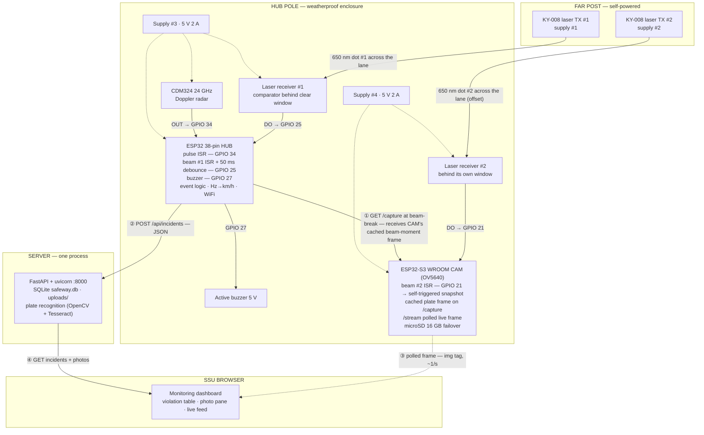
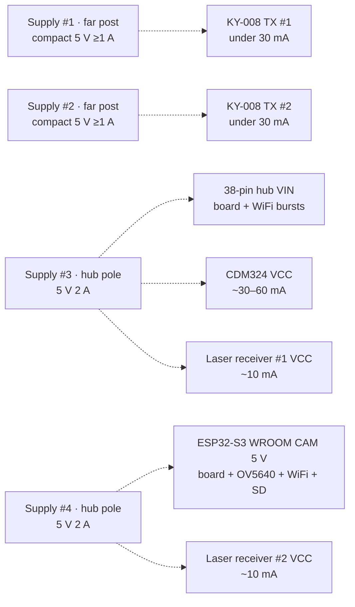

# Block Diagram

Hardware blocks and the signals that connect them — the physical view of SafeWay. Diagrams are **Mermaid** and render natively on GitHub.

---

## 1. Overall System Block Diagram

**Legend:** solid arrows = data · dotted arrows = power · numbered flows:

- ① at beam-break, the hub pulls the evidence photo from the CAM (WiFi) — what it receives is the **beam-moment frame the CAM already captured itself** (vehicle at the pole, plate in frame)
- ② hub uploads the incident JSON (WiFi)
- ③ dashboard live feed goes browser→CAM directly (LAN) — no server relay
- ④ dashboard reads the API
- **No cable crosses the road** — TX #1 and TX #2 each run on their own far-post supply; the two poles talk over WiFi only

---

## 2. Power Distribution — four independent supplies

- Four supplies, zero shared rails ⇒ a camera reboot can never brown-out the radar mid-measurement; a dead far-post supply can never dim the other beam; a hub buzzer/WiFi burst can never ripple the CAM's rail.
- **No cable crosses the road** — each far-post TX is self-powered (compact USB charger inside its housing).
- One rail cap recommended on each board's supply when bench-testing from a single source.

---

## 3. Signal Chain Summary

| Signal | Source → Destination | Conditioning | Meaning |
|---|---|---|---|
| Doppler IF pulses | CDM324 OUT → GPIO 34 | divider **if** §3 scope check reads >3.3 V | pulse rate = 44.7 Hz per km/h |
| Beam #1 level | laser RX #1 DO → GPIO 25 | internal pull-up; divider only if DO swings to 5 V | LOW/HIGH = beam intact/broken (`BEAM_BREAKS_LOW`) |
| Beam #2 level | laser RX #2 DO → GPIO 21 (CAM) | `INPUT_PULLUP`; divider **mandatory** if DO >3.3 V (S3 not 5 V tolerant) | drives the CAM's self-triggered snapshot (`CAM_BEAM_BREAKS_LOW`) |
| Beam #1/#2 (optical) | KY-008 TX #1/#2 → receiver windows | 650 nm dots across the lane, offset a few cm | blocked = solid object crossing |
| Alert | GPIO 27 → buzzer | direct (active 5V module) | HIGH while kph over limit |
| Evidence | CAM self-trigger + `/capture` → hub (WiFi) | beam #2 break → cached PSRAM frame; hub fetches on beam #1 break | plate-frame JPEG (vehicle at the pole) + microSD save |
| Incident | hub → API (WiFi) | JSON POST | speed, limit, doppler_hz, confirmed, photo |

---

Electrical details: [HARDWARE.md](HARDWARE.md) · pin map & wiring tables · full schematic: [wiring/circuit_image.png](../wiring/circuit_image.png)
Data flow logic: [FLOWCHART.md](FLOWCHART.md) · Layers & interfaces: [SYSTEM-ARCHITECTURE.md](SYSTEM-ARCHITECTURE.md)
