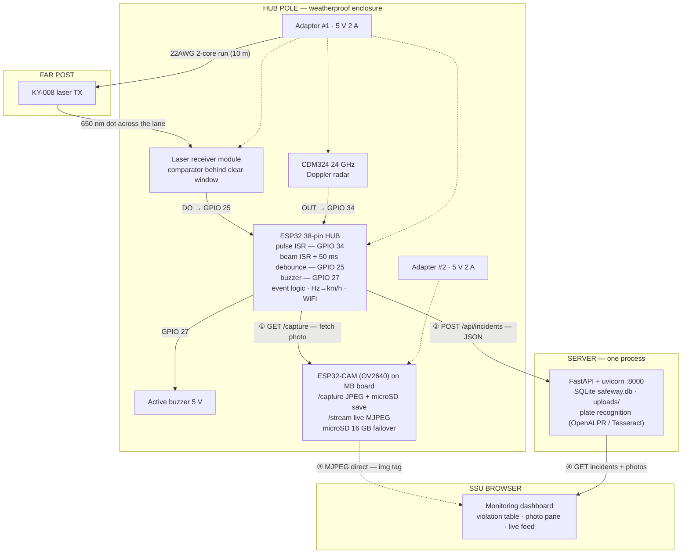
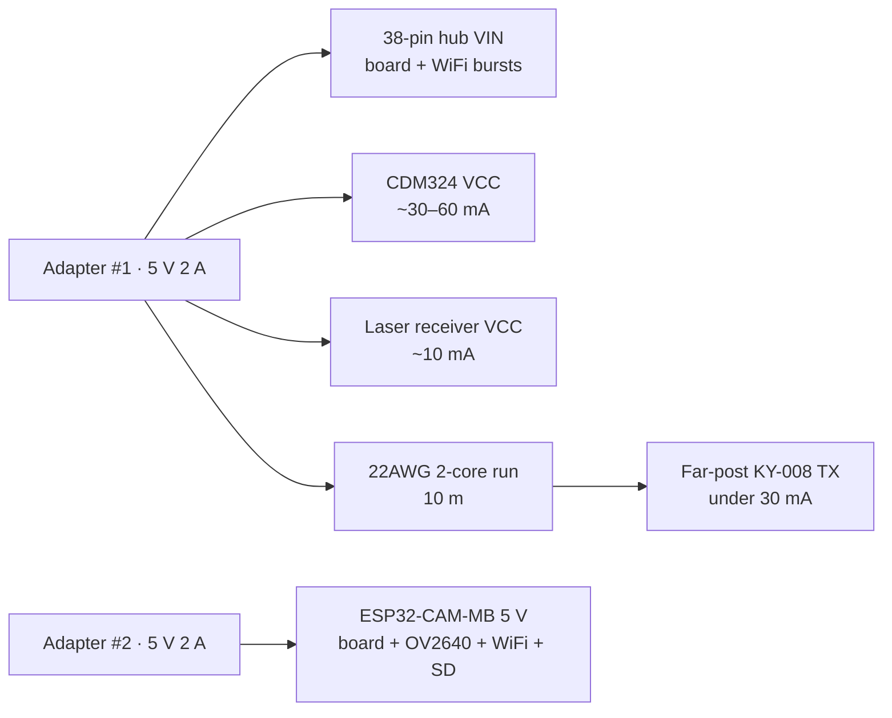

# Block Diagram

Hardware blocks and the signals that connect them — the physical view of SafeWay. Diagrams are **Mermaid** and render natively on GitHub.

---

## 1. Overall System Block Diagram

**Legend:** solid arrows = data · dotted arrows = power · numbered flows:

- ① hub pulls the evidence photo from the CAM (WiFi)
- ② hub uploads the incident JSON (WiFi)
- ③ dashboard live feed goes browser→CAM directly (LAN) — no server relay
- ④ dashboard reads the API

---

## 2. Power Distribution

- Separate adapters ⇒ a camera reboot can never brown-out the radar mid-measurement.
- One rail cap recommended when bench-testing from a single supply.
- Far TX over 22AWG: under 30 mA draw — negligible drop over 10 m, no far-side outlet needed.

---

## 3. Signal Chain Summary

| Signal | Source → Destination | Conditioning | Meaning |
|---|---|---|---|
| Doppler IF pulses | CDM324 OUT → GPIO 34 | divider **if** §3 scope check reads >3.3 V | pulse rate = 44.7 Hz per km/h |
| Beam level | laser RX DO → GPIO 25 | internal pull-up; divider only if DO swings to 5 V | LOW/HIGH = beam intact/broken (`BEAM_BREAKS_LOW`) |
| Beam (optical) | KY-008 TX → receiver window | 650 nm dot across the lane | blocked = solid object crossing |
| Alert | GPIO 27 → buzzer | direct (active 5V module) | HIGH while kph over limit |
| Evidence | CAM `/capture` → hub (WiFi) | base64 in memory | JPEG + microSD save |
| Incident | hub → API (WiFi) | JSON POST | speed, limit, doppler_hz, confirmed, photo |

---

Electrical details: [HARDWARE.md](HARDWARE.md) · pin map & wiring tables
Data flow logic: [FLOWCHART.md](FLOWCHART.md) · Layers & interfaces: [SYSTEM-ARCHITECTURE.md](SYSTEM-ARCHITECTURE.md)
