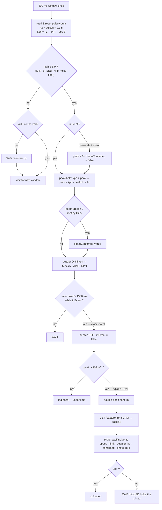
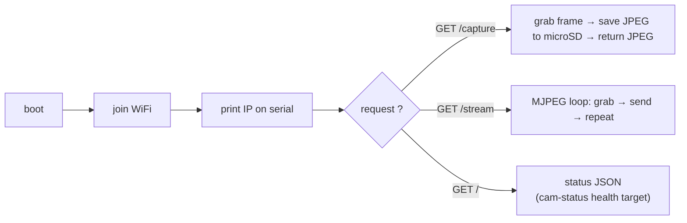
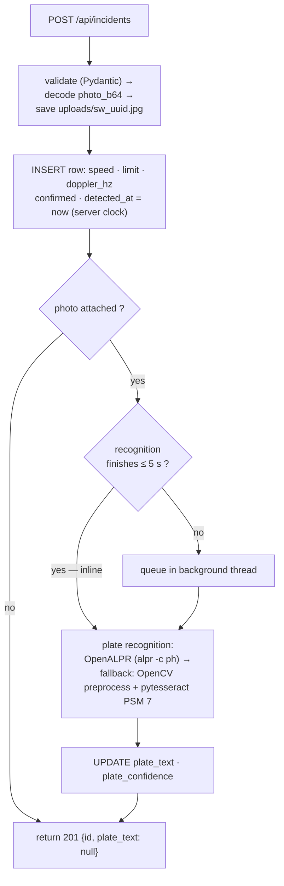

# Flowchart

Runtime behavior, decision by decision — the logic view of SafeWay, matching the actual hub sketch and API. Diagrams are **Mermaid** and render natively on GitHub.

---

## 1. Hub Main Loop — Speed Event Pipeline

Every 300 ms window, the hub samples, decides, and acts:

**Beam ISR (fires any time, GPIO 25, CHANGE):** edge → debounce (edges under 50 ms apart ignored) → read level → `BEAM_BREAKS_LOW` polarity → set/clear `beamBroken`.

## 2. Beam-Confirm vs Radar-Only Event

| Scenario | Radar | Beam | Outcome |
|---|---|---|---|
| Car crosses | kph ≥ 5 | breaks | `confirmed: true` — strongest evidence |
| Branch sways in radar cone | kph ≥ 5 (maybe) | intact | `confirmed: false` — SSU filters it out |
| Car crosses, beam mis-aimed | kph ≥ 5 | intact (fault) | `confirmed: false` — still logged, flagged for review |
| Pedestrian walks the beam | kph under 5 | breaks | no radar event — nothing logged |

## 3. CAM Board Sketch Loop

## 4. Server-Side Incident Pipeline

- Recognition runs inline if it finishes within 5 s, else queued in a background thread — the hub is never blocked waiting on OCR.
- Nightly OCR retry pass fills in plates for photos that were too dark.

## 5. Dashboard Session (SSU personnel)

```mermaid
flowchart LR
    OPEN["open /"] --> LIST["GET /api/incidents?reviewed=false"]
    LIST --> FILTER["filter: All / New only / Reviewed"]
    FILTER --> CONF["filter: confirmed only<br/>(radar + beam agree)"]
    CONF --> ROW["click row → GET /api/incidents/id/photo<br/>→ photo pane"]
    ROW --> LIVE["live lane: img src = http://CAM_IP/stream<br/>(direct from CAM)"]
    LIVE --> REVIEW["review → PATCH /api/incidents/id<br/>{reviewed: 1}"]
    REVIEW --> CAMS["cam-status badge → GET /api/cam-status<br/>(server probes CAM)"]
```

---

Decision logic source: [FIRMWARE.md](FIRMWARE.md) §3 (hub sketch) · API behavior: [BACKEND.md](BACKEND.md) §2–4
Blocks & signals: [BLOCK-DIAGRAM.md](BLOCK-DIAGRAM.md) · Layers: [SYSTEM-ARCHITECTURE.md](SYSTEM-ARCHITECTURE.md)
