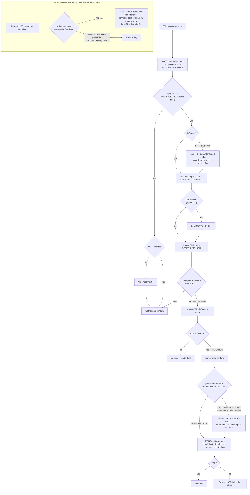
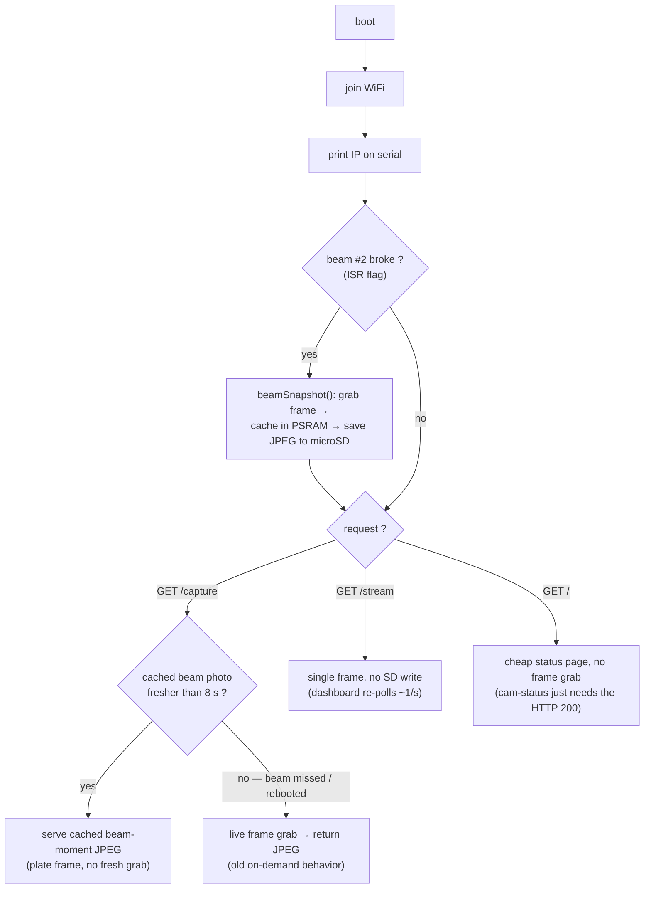
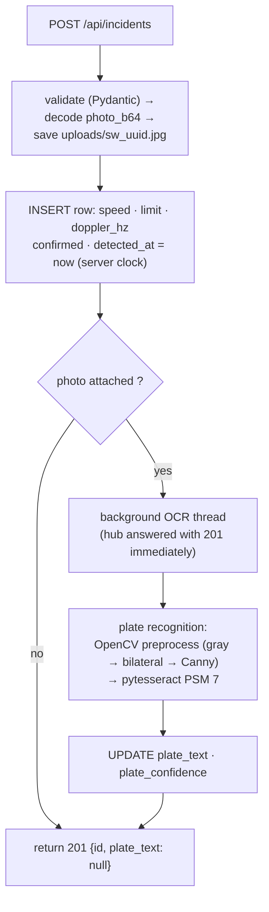
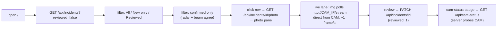

# Flowchart

Runtime behavior, decision by decision — the logic view of SafeWay, matching the actual hub sketch and API. Diagrams are **Mermaid** and render natively on GitHub.

---

## 1. Hub Main Loop — Speed Event Pipeline

A beam-break fast-path rides alongside the window loop on **each board**: the CAM self-triggers its snapshot the instant **beam #2** breaks (it owns both the camera and the trigger), and the hub fires its photo fetch the instant **beam #1** breaks — pulling the CAM's cached beam-moment frame. Every 300 ms window, the hub then samples, decides, and acts:

**Beam ISRs (fire any time, CHANGE):** beam #1 on hub GPIO 25 — edge → debounce (edges under 50 ms apart ignored) → read level → `BEAM_BREAKS_LOW` polarity → set/clear `beamBroken` → if broken, raise the fetch flag (the loop's fast path pulls the CAM's cached photo within milliseconds). Beam #2 on CAM GPIO 21 — same debounce/polarity logic with `CAM_BEAM_BREAKS_LOW` → if broken, the CAM loop runs `beamSnapshot()` itself: grab frame → cache in PSRAM → save to microSD (no HTTP round-trip involved at all).

## 2. Beam-Confirm vs Radar-Only Event

| Scenario | Radar | Beam #1 | Outcome |
|---|---|---|---|
| Car crosses | kph ≥ 5 | breaks | `confirmed: true` — strongest evidence |
| Branch sways in radar cone | kph ≥ 5 (maybe) | intact | `confirmed: false` — SSU filters it out |
| Car crosses, beam #1 mis-aimed | kph ≥ 5 | intact (fault) | `confirmed: false` — still logged, flagged for review |
| Pedestrian walks the beam | kph under 5 | breaks | no radar event — nothing logged |

(Beam #2 never gates `confirmed` — it only triggers the CAM's snapshot. A car crossing the lane breaks both beams in sequence: #2 fires the cached capture, #1 confirms the event.)

## 3. CAM Board Sketch Loop

The CAM's snapshot now fires at **beam #2's interrupt** — before any HTTP request exists. The hub's fetch arrives later and simply receives the cached plate frame (`BEAM2_FRESH_MS` window). Fallback: if no fresh cache exists, `/capture` grabs a live frame — never a hard failure.

## 4. Server-Side Incident Pipeline

- Recognition always runs in a background thread — the hub is answered 201 immediately; the row's plate fields fill in when OCR completes.
- Nightly OCR retry pass fills in plates for photos that were too dark.

## 5. Dashboard Session (SSU personnel)

---

Decision logic source: [FIRMWARE.md](FIRMWARE.md) §3 (hub sketch) · API behavior: [BACKEND.md](BACKEND.md) §2–4
Blocks & signals: [BLOCK-DIAGRAM.md](BLOCK-DIAGRAM.md) · Layers: [SYSTEM-ARCHITECTURE.md](SYSTEM-ARCHITECTURE.md)
