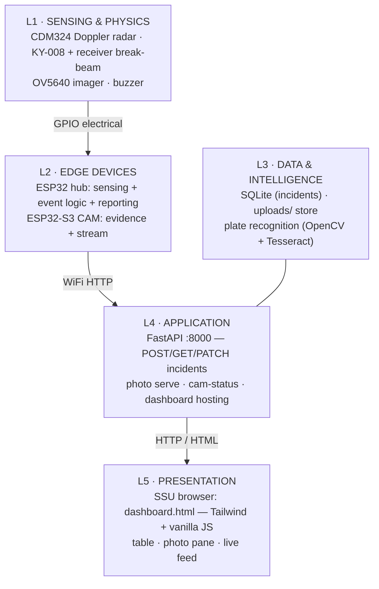
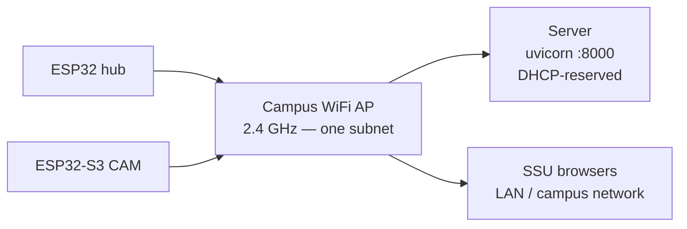
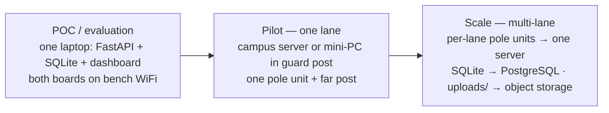

# System Architecture

Layers, boundaries, and interfaces — how SafeWay is organized as a system, from photons to dashboard. Diagrams are **Mermaid** and render natively on GitHub.

---

## 1. Layered View

**Key boundary decisions:**

- **Sensing on the edge, intelligence on the server.** The hub does physics (Hz→km/h), thresholding, and event assembly — everything that must happen in real time. The server does OCR and storage — everything that can wait. A 300 ms loop on the hub never competes with plate recognition on the server.
- **Two boards, one job each.** The ESP32-S3 camera board has pins and PSRAM to spare, but the split stays: sensors and imaging in separate fault domains means a camera crash can't take down speed measurement (and vice versa).
- **Evidence has two paths.** Photo goes hub→server immediately when WiFi is up; microSD on the CAM is the durable copy either way. The system degrades gracefully, never loses evidence.

## 2. Component Responsibilities

| Component | Owns | Never does |
|---|---|---|
| CDM324 radar | IF pulse generation (44.7 Hz/km/h) | — |
| Break-beam pair | presence edge across the lane | speed (radar's job) |
| ESP32 hub | pulse counting, beam ISR+debounce, Hz→km/h, cosine correction, peak-hold, buzzer, beam-break photo snapshot, incident POST | OCR, long-term storage |
| ESP32-S3 CAM | capture on demand, polled live frame, microSD save | speed logic, upload |
| FastAPI server | validation, server-side timestamps, photo storage, OCR orchestration, dashboard hosting | sensing decisions |
| Dashboard | read, filter, review, view live feed | write raw records (only PATCH review) |

## 3. Interfaces (the contract set)

| # | Interface | Protocol | Contract |
|---|---|---|---|
| I1 | Radar OUT → hub GPIO 34 | electrical, RISING ISR | pulses; rate ∝ speed |
| I2 | Beam RX DO → hub GPIO 25 | electrical, CHANGE ISR | level encodes intact/broken (`BEAM_BREAKS_LOW`) |
| I3 | Buzzer ← GPIO 27 | electrical | HIGH = over limit |
| I4 | Hub → CAM `GET /capture` | WiFi HTTP | fires at beam-break (vehicle at the pole — plate in frame) during an active event; fallback fetch at event close; returns JPEG (+ SD save) |
| I5 | Browser → CAM `GET /stream` | LAN HTTP, polled ~1/s | one JPEG per request — pseudo-live, direct, no server relay |
| I6 | Hub → API `POST /api/incidents` | WiFi HTTP JSON | device_id, speed_kph, limit_kph, doppler_hz, confirmed, photo_b64 → 201 |
| I7 | Browser → API GET/PATCH | HTTP JSON | list/filter incidents; mark reviewed; photos |

## 4. Network Topology

- All three WiFi actors sit on one subnet so the browser→CAM frame poll (I5) works without a relay.
- DHCP reservations for hub + CAM + server — static addressing makes `CAM_IP` in firmware and the stream URL in the dashboard stable forever.
- Server can live on a laptop (POC), a campus server, or a small VPS; only requirement is LAN reachability from the pole for photo fetch, and campus reachability for the dashboard.

## 5. Failure Modes & Degradation

| Failure | Immediate effect | System behavior |
|---|---|---|
| WiFi down at pole | upload fails | photos still saved to CAM microSD; hub retries next event; card reconciled at maintenance |
| CAM reboot (heap) | beam-break snapshot fails (and the close-time fallback) | hub logs incident with `confirmed` but no photo; microSD keeps prior photos; CAM auto-recovers ~60 s |
| Server down | POST fails | same as WiFi-down: evidence on microSD, dashboard obviously dark |
| Beam mis-aimed (far post knocked) | confirmed=false always | incidents still log (radar-only); flagged in dashboard for review |
| Radar phantom (branch/banners) | false kph ≥ 5 | beam stays intact → confirmed=false → filtered by SSU |
| Photo too dark (night) | OCR fails | plate_text stays NULL; nightly OCR retry; long-term fix is lighting |

**Design principle:** no single failure loses evidence — the CAM's microSD is the always-write copy, the cloud is the convenient copy.

## 6. Deployment Topology (POC → production path)

The architecture doesn't change between stages — only where the server process runs and which database driver it opens.

---

Interfaces in detail: [BACKEND.md](BACKEND.md) §2 · Firmware contracts: [FIRMWARE.md](FIRMWARE.md) · Signals: [BLOCK-DIAGRAM.md](BLOCK-DIAGRAM.md) · Logic: [FLOWCHART.md](FLOWCHART.md)
