# CDM324 + LM358 Signal Conditioner
## Step-by-Step Build and Testing Guide

> ⚠️ **IMPORTANT**
>
> Huwag buuin at ikonekta ang buong circuit nang sabay-sabay.
> Ang bawat section ay kailangang **i-build, i-measure, at i-confirm**
> gamit ang multimeter bago pumunta sa susunod na section.
>
> **Huwag ikonekta ang LM358 output sa ESP32 GPIO34 hangga't hindi
> pa nakukumpirma ang output voltage.**

---

## 1. Goal ng Circuit

Ang basic signal path ay:

```text
CDM324 Radar
     │
     ▼
Weak analog signal
     │
     ▼
LM358 Amplifier
     │
     ▼
Signal Conditioning
     │
     ▼
ESP32 GPIO34
```

Ang CDM324 signal ay maaaring mahina, kaya ginagamit ang LM358
upang palakasin ito.

Pero ang amplifier output ay **hindi automatic na safe para sa ESP32**.
Kailangan muna itong sukatin at i-condition.

---

# 2. Build Order

Sundin ang sequence na ito:

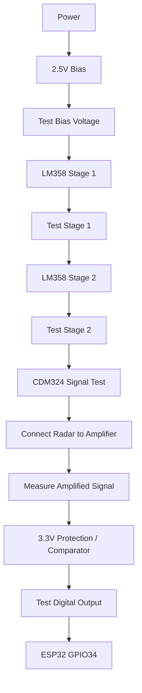

### Important Rule

> **Kung bumagsak ang isang test, huwag muna pumunta sa susunod na step.**
> Ayusin muna ang kasalukuyang stage.

---

# 3. LM358 Pinout

Gamitin ang DIP-8 LM358 na may notch sa taas:

```text
             LM358
        ┌─────────────┐
 OUT A  │ 1         8 │ VCC
 IN− A  │ 2         7 │ OUT B
 IN+ A  │ 3         6 │ IN− B
 GND    │ 4         5 │ IN+ B
        └─────────────┘
             notch
```

| Pin | Function |
|---|---|
| 1 | Output A |
| 2 | Inverting Input A (-) |
| 3 | Non-inverting Input A (+) |
| 4 | GND |
| 5 | Non-inverting Input B (+) |
| 6 | Inverting Input B (-) |
| 7 | Output B |
| 8 | VCC |

---

# 4. Stage 1 — Power Test

## 4.1 LM358 Power Connections

Ikonekta muna ang **power lamang**.

- LM358 Pin 8 → +5V
- LM358 Pin 4 → GND
- 100nF ceramic capacitor → between Pin 8 and Pin 4

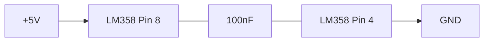

---

## 4.2 Multimeter Test

I-set ang multimeter sa **DC Voltage**.

### Test A — VCC

```text
Red probe   → LM358 Pin 8
Black probe → GND
```

Expected:

```text
≈ 5.0 V
```

### Test B — GND

```text
Red probe   → LM358 Pin 4
Black probe → GND
```

Expected:

```text
≈ 0 V
```

### STOP CONDITION

Huwag magpatuloy kung:

- walang 5V sa Pin 8
- mali ang supply voltage
- hindi connected ang GND
- may abnormal na heating ang LM358

---

# 5. Stage 2 — Gumawa ng 2.5V Bias

Dahil single-supply ang LM358, gagawa tayo ng midpoint reference.

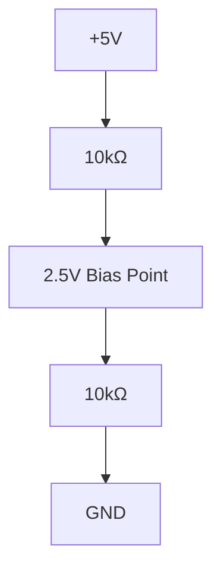

Ang concept ay:

```text
       +5V
        │
       10kΩ
        │
        ├──── 2.5V Bias
        │
       10kΩ
        │
       GND
```

---

## 5.1 Test the 2.5V Bias

### Multimeter

```text
Red probe   → 2.5V Bias Point
Black probe → GND
```

Expected:

```text
≈ 2.5 V
```

Practical readings such as:

```text
2.4 V
2.5 V
2.6 V
```

may be acceptable depending on resistor tolerance and supply voltage.

> ⚠️ **DO NOT continue to the amplifier stage until the bias voltage
> has been measured.**

---

# 6. Stage 3 — LM358 Amplifier Stage 1

Sa unang test, **huwag muna ikonekta ang CDM324**.

Ang purpose muna natin ay makita kung tama ang bias at feedback
ng unang LM358 amplifier.

## 6.1 Connections

Gamitin:

- 100kΩ feedback resistor
- 10kΩ gain resistor


---

## 6.2 Calculate the Gain

Para sa non-inverting amplifier:

\[
A_v = 1 + \frac{R_f}{R_g}
\]

Kung:

\[
R_f = 100kΩ
\]

at:

\[
R_g = 10kΩ
\]

then:

\[
A_v = 1 + \frac{100kΩ}{10kΩ}
\]

\[
A_v = 11
\]

Kaya ang theoretical gain ng Stage 1 ay:

**×11**

---

## 6.3 Stage 1 DC Test

Dahil wala pa tayong radar signal, ang unang bagay na tinitingnan
natin ay ang **DC bias**.

Measure:

```text
Red probe   → LM358 Pin 1
Black probe → GND
```

Expected:

```text
Approximately 2.5 V
```

Hindi kailangang eksaktong 2.500V.

Halimbawa:

```text
2.3 V
2.4 V
2.5 V
2.6 V
```

ay maaaring acceptable depende sa actual circuit.

> ⚠️ Ang test na ito ay **bias test lamang**.
> Hindi pa nito pinapatunayang amplified na ang CDM324 signal.

---

# 7. Stage 4 — LM358 Amplifier Stage 2

Pumunta lamang dito kapag successful ang Stage 1 test.

Gamitin ang second amplifier ng LM358:

```text
Pin 5 = +
Pin 6 = -
Pin 7 = OUT
```

## 7.1 Connections


Ang theoretical gain ng Stage 2 ay:

\[
A_v = 1 + \frac{100kΩ}{10kΩ}
\]

\[
A_v = 11
\]

Kung parehong ginagamit ang dalawang stages:

\[
11 \times 11 = 121
\]

So ang theoretical total gain ay:

**×121**

> ⚠️ Huwag agad gumamit ng ×10,000 gain.
> Ang sobrang taas na gain ay maaaring magdulot ng clipping,
> saturation, at malaking amplification ng noise.

---

## 7.2 Stage 2 DC Test

Measure:

```text
Red probe   → LM358 Pin 7
Black probe → GND
```

Expected:

```text
Approximately 2.5 V
```

Kung ang output ay malapit sa:

```text
0 V
```

o:

```text
5 V
```

sa halip na nasa paligid ng midpoint, **stop muna** at i-check
ang wiring.

---

# 8. Stage 5 — CDM324 Signal Test

> ⚠️ **HUWAG agad ikonekta ang CDM324 sa LM358.**

Una, kailangang malaman ang actual signal ng **specific CDM324 module**
na ginagamit.

Ang pangalan ng output ay maaaring depende sa module/board implementation.
Huwag ipagpalagay na lahat ng CDM324 boards ay pareho.

---

## 8.1 Identify the Signal Output

Hanapin ang documented:

```text
OUT
IF
SIGNAL
```

o ang equivalent signal-output pin ng iyong module.

Kung hindi sigurado, tingnan muna ang schematic/datasheet ng
specific module.

---

## 8.2 Measure the Radar Output

Power the CDM324 according to its documented supply requirements.

Pagkatapos, sukatin muna ang suspected signal output relative sa GND.

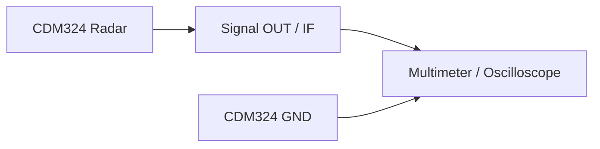

I-record ang measurements:

```text
DC voltage:
________ V

Voltage with no moving target:
________ V

Voltage with moving target:
________ V

Approximate minimum:
________ V

Approximate maximum:
________ V
```

Kung may oscilloscope, mas useful dahil makikita ang actual waveform.

---

# 9. Stage 6 — Connect CDM324 to the Amplifier

Only proceed after the CDM324 output has been identified and measured.

Gamitin ang coupling capacitor kung required ng signal-conditioning
design.

General signal path:

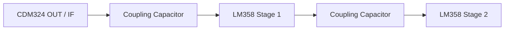

> ⚠️ Ang exact capacitor polarity at value ay kailangang i-confirm
> batay sa measured DC level ng actual CDM324 output at sa final
> amplifier topology.

---

# 10. Stage 7 — Measure the Amplified Signal

Pagkatapos ikonekta ang radar signal, **huwag muna ikonekta sa ESP32**.

Measure the LM358 output first.

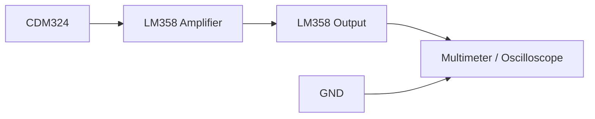

Measure:

```text
Minimum voltage:
________ V

Maximum voltage:
________ V

Idle voltage:
________ V
```

Kung may oscilloscope:

```text
Idle waveform:
____________________

Motion waveform:
____________________
```

---

# 11. IMPORTANT — ESP32 GPIO34 Test Gate

> 🚨 **DO NOT CONNECT LM358 OUTPUT DIRECTLY TO GPIO34 YET.**

Ang ESP32 ay gumagamit ng **3.3V logic**.

Ang LM358 naman ay maaaring ma-supply ng 5V at ang output nito
ay maaaring lumampas sa safe range na gusto nating gamitin para
sa ESP32.

Kaya kailangan munang sukatin ang maximum output.

---

## 11.1 Measure LM358 Output

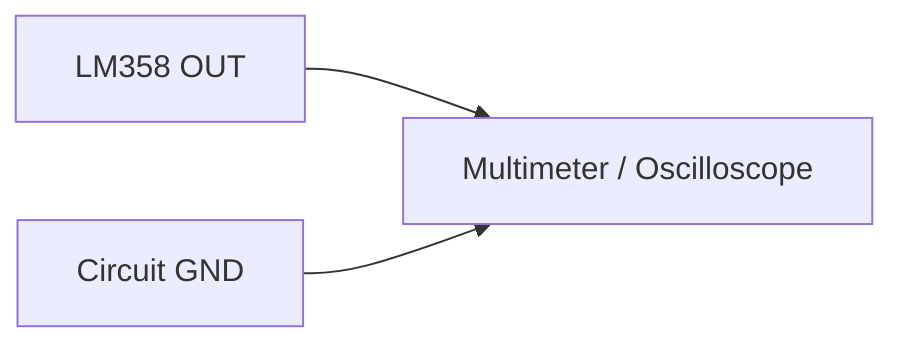

Record:

```text
Idle:
______ V

Minimum:
______ V

Maximum:
______ V
```

**Huwag mag-assume na safe dahil lamang mukhang maliit ang signal.**

---

# 12. Recommended Digital Signal Stage

Kung ang goal ay makakuha ng clean HIGH/LOW pulses,
mas magandang magkaroon ng comparator o Schmitt-trigger stage.

Recommended architecture:

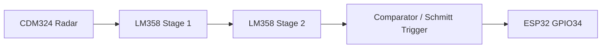

Ang purpose ng comparator:

```text
Analog waveform
      │
      ▼
Comparator
      │
      ├──── LOW
      │
      └──── HIGH
```

Sa ganitong paraan, hindi kailangang hulaan ng ESP32 kung anong
analog voltage ang ibig sabihin ng "motion".

---

# 13. Final ESP32 Connection

Kapag na-test na ang signal-conditioning stage at napatunayang
ESP32-compatible ang output:

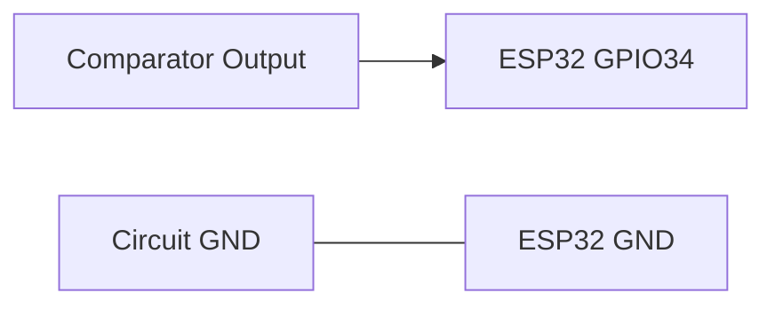

Important:

- GPIO34 is input-only.
- Ang signal ay dapat compatible sa 3.3V logic.
- Dapat common ang signal ground ng ESP32 at signal-conditioning circuit
  kung required ng final design.

---

# 14. Complete Tested Signal Path

Kapag successful na ang bawat individual test:

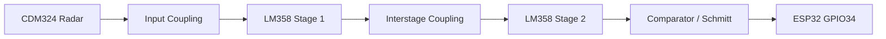

---

# 15. Testing Checklist

Gamitin ang checklist na ito habang nag-aassemble:

```text
[ ] LM358 Pin 8 = approximately +5V
[ ] LM358 Pin 4 = 0V
[ ] 100nF decoupling capacitor installed
[ ] 2.5V bias created
[ ] 2.5V bias measured
[ ] Stage 1 wired
[ ] Stage 1 DC output tested
[ ] Stage 2 wired
[ ] Stage 2 DC output tested
[ ] CDM324 signal pin identified
[ ] CDM324 signal measured before connection
[ ] Radar connected to amplifier
[ ] Amplifier output measured
[ ] Maximum amplifier output measured
[ ] Comparator / protection stage tested
[ ] Comparator output confirmed as 3.3V-compatible
[ ] Only then connect to GPIO34
```

---

# 16. Troubleshooting Flow

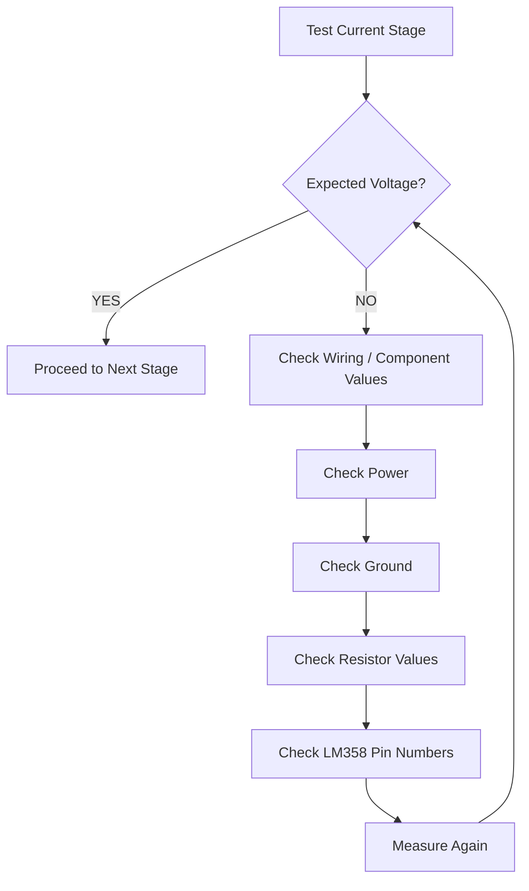

---

# 17. Why We Test Before Connecting Everything

Ang pangunahing rule ng tutorial na ito ay:

```text
BUILD
  ↓
MEASURE
  ↓
COMPARE WITH EXPECTED VALUE
  ↓
PASS?
 ├── NO → TROUBLESHOOT
 │
 └── YES
       ↓
    NEXT STAGE
```

Hindi ibig sabihin na kapag nakita mo ang complete schematic,
kailangan mong ikonekta agad lahat.

Ang complete schematic ay **reference ng buong system**.

Ang actual assembly ay ginagawa nang **paunti-unti at sinusukat
ang bawat stage**.

---

# 18. Important Notes

### About ×10,000 Gain

Ang original theoretical configuration na:

\[
101 \times 101 = 10,201
\]

ay maaaring maging sobrang taas para sa unang prototype.

Halimbawa:

\[
0.5mV \times 10,000 = 5V
\]

At kung mas mataas pa ang input signal, magki-clip ang amplifier.

Para sa initial testing, mas madaling magsimula sa:

\[
11 \times 11 = 121
\]

at dagdagan lamang ang gain pagkatapos masukat ang actual CDM324 signal.

### About the LM358

Ang LM358 ay analog operational amplifier.
Hindi ito automatic na digital pulse generator.

Kung kailangan ng ESP32 ng clean digital pulses:

```text
LM358
  ↓
Comparator / Schmitt Trigger
  ↓
ESP32 GPIO34
```

ay mas predictable kaysa direktang analog output papunta sa GPIO.

### About GPIO34

GPIO34 ay input-only.

Huwag itong gamitin bilang output.

At huwag ikonekta ang isang unknown-voltage signal dito nang hindi
muna sinusukat ang maximum voltage.

---

# 19. Final Rule

> **MEASURE FIRST. CONNECT SECOND.**

Huwag hulaan ang voltage.

Huwag ipagpalagay na pareho ang lahat ng CDM324 modules.

Huwag ipagpalagay na ang LM358 output ay safe para sa ESP32.

Ang tamang sequence ay:

```text
Power
  ↓
Measure
  ↓
Bias
  ↓
Measure
  ↓
Amplifier
  ↓
Measure
  ↓
Radar
  ↓
Measure
  ↓
Signal conditioning
  ↓
Measure
  ↓
ESP32
```

Ito ang approach na gagamitin natin para maging safe at madaling sundan
ang prototype.
